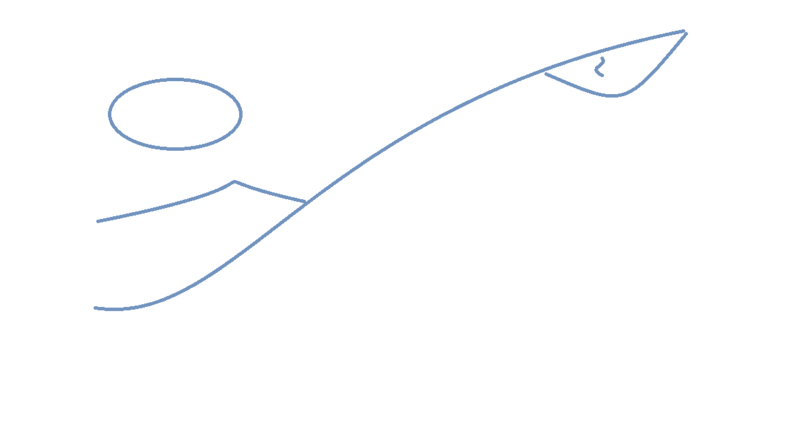

# Unity Project Generator

Unity project generator is a Yeoman generator <https://yeoman.io/>. It creates a template unity project structure for the framework.

This package is generated using generator-generator package. <https://github.com/yeoman/generator-generator>

## Pre-requisite

1. Node.js <https://nodejs.org/en/download/>
2. Yeoman Generator <https://yeoman.io/>

```bash
npm install -g yo
```

## Installation

Navigate to Framework\Generators\generator-unity-project and run below command

```bash
npm install -g
```

## Run

Navigate to Framework\Projects\ and run below command. It may take a few minutes until the Yeoman dialogue pops up.

```bash
yo unity-project
```

### Test md with images



### Create Token


